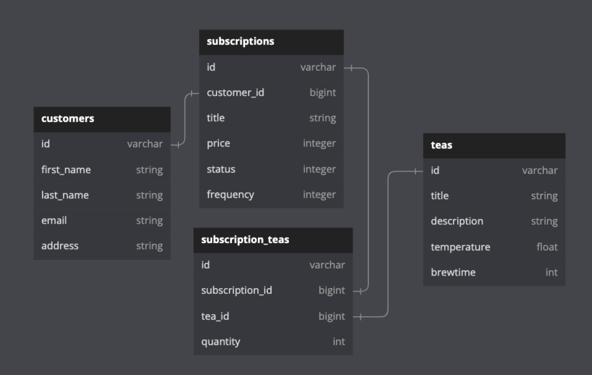

# TEA SERVICE README

  

## Description

Tea Service is an a solo practice Rails API application meant to simulate "take-home" challenges with future employment prospects. The challenge specifications can be found [here](https://mod4.turing.edu/projects/take_home/take_home_be).

---

## Local Setup

### Requirements

- Ruby 2.7.4
- Rails 5.2.8

### Steps

1. Clone this repository: `git clone git@github.com:musselmanth/tea_service.git`
2. Navigate to directory: `cd tea_service`
3. Install dependencies: `bundle install`
4. Setup PostgreSQL Database and seed with mock data: `rails db:{create,migrate,seed}`
5. Start local puma server to hit endpoints at http://localhost:3000/api/v1 : `rails server`

---

## Database Schema Diagram



---

## API Endpoints

### Index

- [Get a Cusomtomer's Tea Subscriptions](#get-a-customers-tea-subscriptions)
- [Subscribe A Customer to a Subscription](#subscribe-a-customer-to-a-subscription)
- [Cancel A Customer's Subscription](#cancel-a-customers-subscription)
  <br><br>

> ## Get a Customer's Tea Subscriptions
>
> GET `/api/v1/customers/<customer_id>/subscriptions`
>
> Example Response:
>
> ```JSON
> {
>   "data": [
>     {
>       "id": "1",
>       "type": "subscription",
>       "attributes": {
>         "title": "Et aut.",
>         "price": 6671,
>         "frequency": 2,
>         "status": "active",
>         "teas": [
>           {
>             "tea_id": "9",
>             "quantity": 9
>           },
>           {
>             "tea_id": "15",
>             "quantity": 10
>           }
>         ]
>       }
>     },
>     {
>       "id": "2",
>       "type": "subscription",
>       "attributes": {
>         "title": "Fugit aut.",
>         "price": 9808,
>         "frequency": 2,
>         "status": "cancelled",
>         "teas": [
>           {
>             "tea_id": "4",
>             "quantity": 8
>           },
>           {
>             "tea_id": "20",
>             "quantity": 9
>           },
>           {
>             "tea_id": "25",
>             "quantity": 7
>           }
>         ]
>       }
>     }
>   ]
> }
> ```
>
> Notes:
>
> - Frequency: Number of Weeks between orders. So 4 is equal to every 4 weeks or montly
> - Price: Stored as integer in cents. 7857 = $75.57
>
> [Back To Top](#api-endpoints)

<br><br>

> ## Subscribe A Customer to a Subscription
>
> POST `/api/v1/customers/<customer_id>/subscriptions`
>
> Example JSON Body:
>
> ```JSON
> {
>   "title": "Monthly Green Teas",
>   "price": 4500,
>   "frequency": 4,
>   "teas": [
>     {
>       "quantity": 1,
>       "tea_id":157
>     },
>     {
>       "quantity": 4,
>       "tea_id": 158
>     }
>   ]
> }
> ```
>
> Notes:
>
> - Frequency: Number of Weeks between orders. So 4 is equal to every 4 weeks or montly
> - Price: Stored as integer in cents. 7857 = $75.57
>
> Example Response:
>
> ```JSON
> {
>   "data": {
>     "id": "3",
>     "type": "subscription",
>     "attributes": {
>       "title": "Monthly Green Teas",
>       "price": 4500,
>       "frequency": 4,
>       "status": "active",
>       "teas": [
>         {
>           "tea_id": "1",
>           "quantity": 1
>         },
>         {
>           "tea_id": "2",
>           "quantity": 4
>         }
>       ]
>     }
>   }
> }
> ```
>
> [Back To Top](#api-endpoints)

<br><br>

> ## Cancel A Customer's Subscription
>
> PATCH `/api/v1/customers/<customer_id>/subscriptions/<subscription_id>`
>
> Example JSON Body:
>
> ```JSON
> {
>   "status": "cancelled"
> }
> ```
>
> Example Response:
>
> ```JSON
> {
>   "data": {
>     "id": "3",
>     "type": "subscription",
>     "attributes": {
>       "title": "Monthly Green Teas",
>       "price": 4500,
>       "frequency": 4,
>       "status": "cancelled",
>       "teas": [
>         {
>           "tea_id": "1",
>           "quantity": 1
>         },
>         {
>           "tea_id": "2",
>           "quantity": 4
>         }
>       ]
>     }
>   }
> }
> ```
>
> [Back To Top](#api-endpoints)

<br><br>

---
